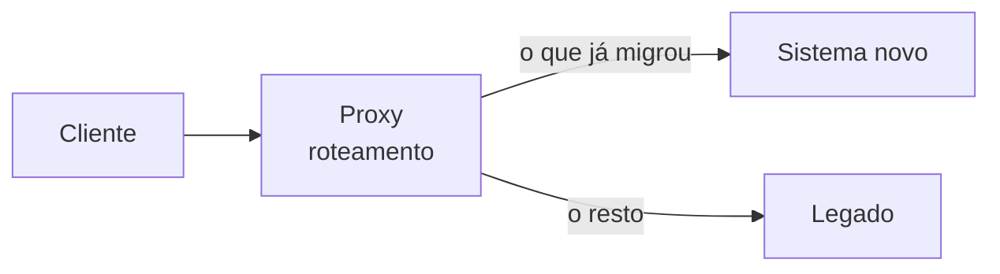

Texto de exemplo da parte 2. Volte para [[por-que-migrar]].

## Exemplo de diagrama

```mermaid
flowchart LR
    cliente[Cliente] --> proxy[Proxy<br/>roteamento]
    proxy -->|o que já migrou| novo[Sistema novo]
    proxy -->|o resto| legado[Legado]
```
